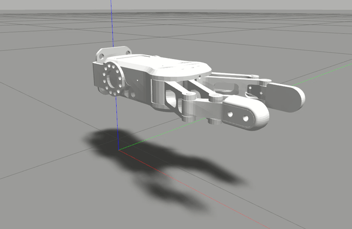

# Unofficial RG2 Gripper URDF Model for ROS and Gazebo Simulation

## Running The Simulation Model

This package requires Gazebo MimicJointPlugin from this repo https://github.com/roboticsgroup/roboticsgroup_gazebo_plugins.

**Create your own ROS workspace, clone the repo, and compile**

```bash
mkdir -p rg2_ws/src
cd rg2_ws/src
git clone https://github.com/ekorudiawan/rg2_simulation.git
B
git clone https://github.com/roboticsgroup/roboticsgroup_gazebo_plugins.git
cd ../
catkin_make
source devel/setup.bash
```

**Launch the simulation model**

```bash
roslaunch rg2_gazebo rg2_gazebo.launch
```

**Controlling gripper with ROS topic**

```bash
rostopic pub /rg2/gripper_joint_position/command std_msgs/Float64 "data: 1.0"
```

**Result**


